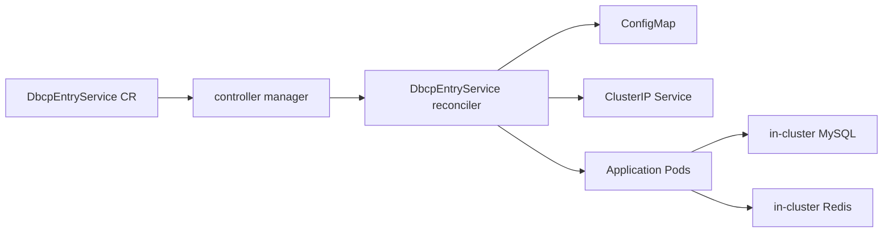

# Go Entry User Management and Operator Design

## Overview

This repository contains two tightly related parts:

- a user management application that serves a browser UI and executes authentication, profile, and media operations against MySQL and Redis
- a Kubernetes operator that models that application as a custom resource and reconciles the runtime objects needed to keep it running inside a cluster

The application and the operator are intentionally coupled through configuration. The application accepts database, Redis, and service-export settings through environment variables, while the operator translates `DbcpEntryService` custom resources into those environment variables by materializing Kubernetes-native resources.

The implementation focus is in the `operator/` directory. The `cloud_native_entry_task/CRD` directory matters here only because it contains the published CRD shape and the sample CR used as the deployment input template.



## User Management System Design

### Runtime split and responsibilities

The user management system is packaged as a multi-process service:

- `nginx` serves the static frontend and exposes the public HTTP port
- `cmd/httpd` runs the HTTP gateway that accepts browser API calls
- `cmd/tcpd` runs the stateful backend logic that owns authentication, profile updates, file metadata, and database access

This split exists for a practical reason. The browser-facing surface stays simple and HTTP-oriented, while the internal business logic is isolated behind a TCP protocol that the gateway speaks on behalf of the client. The result is a container image that still presents one service endpoint externally, but keeps transport concerns and business concerns separated internally.

### Data and dependency model

The backend depends on two storage systems:

- MySQL is the source of truth for users, credentials, nickname data, and profile picture metadata
- Redis is used for session storage and profile picture cache when configured and reachable

The TCP backend treats Redis as optional. It always requires MySQL, but it can continue running without Redis by falling back to a reduced mode where Redis-backed sessions and picture caching are unavailable.

### Configuration flow

The application configuration is loaded from JSON and then overridden by environment variables. The important design detail is that the DBCP-facing fields act as indirection:

- `dbcp.target_db` overrides `database.dsn`
- `dbcp.target_redis` overrides `redis.addr`

That precedence is what makes the operator integration work cleanly. The operator only needs to provide `DBCP_TARGET_DB` and `DBCP_TARGET_REDIS`, and the application automatically points itself at the cluster-scoped dependencies the operator selected.

### Why the container is modeled this way

This is not a pure single-process web service and not a fully decomposed microservice set either. The chosen model gives three benefits:

- one deployable unit for the platform side
- a clean internal boundary between HTTP handling and business execution
- a straightforward contract for the operator, which only has to run Pods with the right image and environment

From the cluster’s perspective, the application is still one workload. Internally, it is layered so that the controller does not need to understand login logic, TCP framing, session management, or file handling.

## Operator SDK Structure and Controller Design

### SDK-generated structure with project-specific logic

The operator follows the standard Kubebuilder / Operator SDK layout:

- `operator/api/v1alpha1/dbcpentryservice_types.go` defines the custom resource schema in Go
- the generated CRD under `operator/config/crd/bases/` is derived from those Go types and validation markers
- `operator/cmd/main.go` creates the controller manager and registers the reconciler
- `operator/internal/controller/dbcpentryservice_controller.go` contains the actual reconciliation behavior

The scaffold gives the manager, scheme registration, RBAC generation points, and CRD generation flow. The project-specific logic begins once the `DbcpEntryServiceReconciler` is registered with the manager.

### Custom resource spec model

The operator exposes a compact custom resource:

```yaml
spec:
  config:
    targetDB: "<mysql dsn>"
    targetRedis: "<redis host:port>"
    serviceExportPort: 8080
  service:
    image: "<application image>"
    replicas: 2
    resources:
      requests:
        cpu: "100m"
        memory: "128Mi"
      limits:
        cpu: "500m"
        memory: "512Mi"
```

The meaning of the fields is intentionally narrow:

- `spec.config.targetDB`: the MySQL DSN the backend must use
- `spec.config.targetRedis`: the Redis address the backend must use
- `spec.config.serviceExportPort`: the port exposed by the Kubernetes Service
- `spec.service.image`: the full application image containing Nginx, `httpd`, and `tcpd`
- `spec.service.replicas`: the desired number of application Pods
- `spec.service.resources`: CPU and memory requests and limits for the application container

This spec does not model MySQL or Redis lifecycle. Those dependencies are external from the controller’s point of view. The controller’s job is to project this spec into runtime configuration and application Pods.

### Manager registration and control loop entry

`operator/cmd/main.go` creates the controller-runtime manager and registers `DbcpEntryServiceReconciler` against it. After that point, every relevant custom resource event is routed into the reconciler.

The reconciler is also wired with a periodic full-sync mechanism. In addition to normal event-driven reconciliation, `SetupWithManager` creates a ticker that re-enqueues every `DbcpEntryService` object every five seconds. This means the controller is not relying only on watch events. It continuously re-checks desired versus actual state.

### Reconcile logic

The reconcile flow in `operator/internal/controller/dbcpentryservice_controller.go` is straightforward and state-oriented:

1. Fetch the `DbcpEntryService` object for the request.
2. If the object is being deleted, delete owned Pods, Service, and ConfigMap, then remove the finalizer.
3. If the finalizer is missing on a live object, add it and return.
4. Compute a spec hash based on rendered configuration, image, resources, and exposed ports.
5. Reconcile the ConfigMap that carries the application environment.
6. Reconcile the ClusterIP Service that exposes the HTTP port.
7. Reconcile the application Pods to match the desired replica count and spec hash.

The controller does not create a Deployment for the application workload. Instead, it manages raw Pods directly and uses labels plus a spec hash to decide which Pods are current.

### Resource rendering model

The rendered ConfigMap is the bridge between the CR and the application runtime. It includes:

- `DBCP_TARGET_DB`
- `DBCP_TARGET_REDIS`
- `DBCP_SERVICE_EXPORT_PORT`
- TCP, HTTP, upload, session, Redis timeout, and token-secret settings required by the containerized application

Each application Pod uses `EnvFrom` with that ConfigMap, so the controller does not need to inject many separate environment variables one by one. The Service selects Pods using controller-managed labels and exports the configured service port to the container port named `http`.

### Pod replacement and scaling behavior

Pod reconciliation uses three rules:

- terminated Pods are deleted
- Pods whose `labelSpecHash` differs from the newly calculated desired hash are deleted as outdated
- Pod count is scaled up or down to match `spec.service.replicas`

When scaling down, the controller removes the newest Pods first after sorting by creation time. When scaling up, it creates new Pods from the desired template. When configuration changes, old Pods are deleted and recreated because their hash no longer matches the desired rendered state.

### Cleanup behavior

The controller attaches a finalizer to each custom resource. On CR deletion, it explicitly removes the resources it owns:

- application Pods
- the per-CR Service
- the per-CR ConfigMap

Only after cleanup succeeds does it remove the finalizer and allow Kubernetes to complete the CR deletion.

## CR-to-Reconcile-to-Cluster Flow

### Publication path

The runtime path begins when a `DbcpEntryService` resource is applied to the cluster:

1. Kubernetes validates the object against the CRD schema generated from the Go API types.
2. The controller manager sees the custom resource event and dispatches it to the reconciler.
3. The reconciler reads `spec.config` and `spec.service`.
4. It renders a ConfigMap containing the application runtime configuration.
5. It renders a ClusterIP Service for the public HTTP endpoint.
6. It creates or replaces application Pods so they consume the ConfigMap and run the requested image and replica count.
7. The application Pods connect to MySQL and Redis using the values the controller placed into the ConfigMap.

### Reconcile lifecycle sequence

1. CR is created or updated.
2. Manager enqueues the object for reconcile.
3. Reconciler ensures finalizer presence.
4. Reconciler computes desired rendered state and spec hash.
5. ConfigMap is created or updated from CR fields.
6. Service is created or updated from CR fields.
7. Pods are created, deleted, or replaced until runtime state matches the spec.
8. Periodic full-sync keeps checking drift even without a new CR event.

### What happens after later spec changes

Later mutations to the custom resource take effect through the same loop:

- changing `spec.service.replicas` changes the target Pod count
- changing `spec.service.image`, resources, or any rendered config field changes the spec hash and triggers Pod replacement
- changing `spec.config.serviceExportPort` updates the Service and also contributes to the hash model used for runtime convergence

This gives the controller a simple but effective convergence strategy. It does not patch a Deployment template. It recalculates the desired state and removes Pods that no longer match it.

### Remote deployment nuance

The repository also contains a remote deployment helper that explains why runtime behavior can differ from the literal values stored in the sample CR file.

`operator/scripts/deploy_remote.sh` does not apply `cloud_native_entry_task/CRD/dbcp-entry-service-sample.yaml` verbatim. Before applying the CR, it copies the sample into a temporary manifest and rewrites:

- `targetDB` to the in-cluster MySQL Service DNS
- `targetRedis` to the in-cluster Redis Service DNS
- `service.image` to the remote registry image

As a result, the cluster does not depend on the outdated literal IP values that may still appear in the sample YAML. The effective runtime configuration is the rewritten CR that is actually applied, and that rewritten CR is what the reconciler reads and turns into a ConfigMap and Pods.

## Design Characteristics and Current Constraints

- The controller manages raw Pods for the application workload instead of using a Deployment or StatefulSet.
- Reconciliation is both event-driven and periodically forced through a five-second full-sync loop.
- `status` exists on the custom resource type, but it is currently unused and the controller does not publish observed state there.
- MySQL and Redis are treated as external dependencies from the controller’s perspective, even when remote deployment scripts create in-cluster instances for convenience.
- Rolling replacement is implemented by spec-hash mismatch detection and Pod deletion, not by a higher-level rollout controller.

## Practical Reading Guide

For the core implementation, the most useful entry points are:

- `operator/api/v1alpha1/dbcpentryservice_types.go`
- `operator/internal/controller/dbcpentryservice_controller.go`
- `operator/cmd/main.go`

Together, these files show the CR contract, the registration path into controller-runtime, and the exact logic that converts a `DbcpEntryService` object into running cluster resources.
