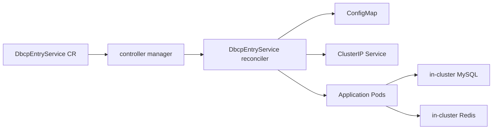

# Go Entry 用户管理系统与 Operator 设计说明

## 概览

这个仓库包含两部分紧密相关的内容：

- 一个用户管理系统应用，负责向浏览器提供页面与接口，并执行认证、资料维护和图片相关操作，底层依赖 MySQL 与 Redis
- 一个 Kubernetes Operator，将该应用抽象为自定义资源，并在集群内持续协调出运行它所需的 Kubernetes 资源

两者之间通过配置形成了明确衔接。应用本身通过环境变量接收数据库、Redis 和服务暴露端口等参数；Operator 则负责把 `DbcpEntryService` 自定义资源中的配置翻译为这些运行时环境变量，并以 Kubernetes 原生资源的形式落地。

这份说明的重点放在 `operator/` 目录。`cloud_native_entry_task/CRD` 目录只在两个场景下被提及：

- 说明对外发布的 CRD 结构
- 说明远程部署时 sample CR 是怎样被重写后再发布到集群中的



## 用户管理系统本体设计

### 运行时分层与职责划分

用户管理系统被打包为一个多进程服务，内部包含三层：

- `nginx`：负责提供静态前端资源，并对外暴露 HTTP 入口
- `cmd/httpd`：负责浏览器接口层，接收 HTTP API 请求并转发给内部 TCP 后端
- `cmd/tcpd`：负责真正的业务逻辑，包括登录认证、用户资料修改、图片元数据维护以及数据库访问

这样拆分的目的很明确。浏览器侧仍然只面对一个普通的 HTTP 服务，但内部把“接口接入层”和“核心业务执行层”做了隔离。最终产物对平台来说仍是一个镜像、一个服务单元，但内部结构更清晰，Operator 也不需要理解具体的登录逻辑或协议细节。

### 数据依赖模型

系统依赖两个存储组件：

- MySQL：作为用户、密码、昵称、图片元数据等核心业务数据的真实存储
- Redis：用于会话存储以及头像图片缓存

这里有一个重要特性：MySQL 是强依赖，Redis 是弱依赖。`tcpd` 启动时会先连 MySQL，如果 MySQL 不可用则直接失败；如果 Redis 配置了但不可达，服务会降级继续运行，只是失去 Redis 会话与图片缓存能力。

### 配置流转方式

应用配置先从 JSON 文件加载，再被环境变量覆盖。其中和 Operator 对接最关键的是 DBCP 这一层配置：

- `dbcp.target_db` 会覆盖 `database.dsn`
- `dbcp.target_redis` 会覆盖 `redis.addr`

这个设计让 Operator 的职责变得非常清晰。它不需要改应用代码，只需要把 `DBCP_TARGET_DB` 和 `DBCP_TARGET_REDIS` 等变量写进 ConfigMap，再由 Pod 以环境变量方式注入，应用就会自动切换到集群内指定的 MySQL 与 Redis。

### 为什么采用这种多进程容器模型

这个系统既不是单体单进程 HTTP 服务，也不是完全拆开的多个独立微服务，而是介于两者之间的折中设计。这样做有三个直接好处：

- 对平台交付来说，仍然只是一个可部署单元
- 对应用内部来说，HTTP 接入层与业务执行层有清晰边界
- 对 Operator 来说，只需要管理镜像、环境变量、端口和 Pod 数量即可

换句话说，集群里看到的是一个工作负载，容器内部则保留了足够清晰的职责分层。

## Operator SDK 结构与 Controller 设计

### SDK 生成骨架与项目自定义逻辑的分界

这个 Operator 基于 Kubebuilder / Operator SDK 的标准目录结构生成，核心分工如下：

- `operator/api/v1alpha1/dbcpentryservice_types.go`：定义自定义资源的 Go 类型与字段校验
- `operator/config/crd/bases/`：由上述 Go 类型和 kubebuilder 标记生成出的 CRD 清单
- `operator/cmd/main.go`：负责创建 controller-runtime manager，并把 reconciler 注册进去
- `operator/internal/controller/dbcpentryservice_controller.go`：真正承载业务协调逻辑

SDK 生成的是控制器框架、scheme 注册、RBAC 生成位点和 CRD 生成流程；项目真正的“控制逻辑”是你在 `DbcpEntryServiceReconciler` 里补上的。

### 自定义资源 spec 结构

当前 Operator 暴露出的 CR 结构很紧凑：

```yaml
spec:
  config:
    targetDB: "<mysql dsn>"
    targetRedis: "<redis host:port>"
    serviceExportPort: 8080
  service:
    image: "<application image>"
    replicas: 2
    resources:
      requests:
        cpu: "100m"
        memory: "128Mi"
      limits:
        cpu: "500m"
        memory: "512Mi"
```

这些字段的职责边界是明确的：

- `spec.config.targetDB`：业务后端实际连接的 MySQL DSN
- `spec.config.targetRedis`：业务后端实际连接的 Redis 地址
- `spec.config.serviceExportPort`：对外暴露的 Kubernetes Service 端口
- `spec.service.image`：应用镜像，内部包含 Nginx、`httpd`、`tcpd`
- `spec.service.replicas`：期望的业务 Pod 副本数
- `spec.service.resources`：业务容器的资源请求与限制

这个 spec 没有把 MySQL 和 Redis 的生命周期纳入 CR 管理范围。换句话说，Controller 关注的是“如何把应用按指定配置跑起来”，而不是“如何设计整个依赖栈”。

### Manager 注册与控制循环入口

`operator/cmd/main.go` 中会创建 controller-runtime manager，并把 `DbcpEntryServiceReconciler` 注册进去。自那之后，相关的自定义资源事件就会被送入这个 reconciler。

除了标准的事件驱动机制之外，这个 controller 还额外实现了一层周期性全量同步：`SetupWithManager` 中启动了一个 ticker，每隔 5 秒把当前所有 `DbcpEntryService` 对象重新 enqueue 一次。这意味着它不仅依赖 watch 事件，也会周期性重新检查“当前状态是否仍然收敛到期望状态”。

### Controller 的 reconcile 主逻辑

`operator/internal/controller/dbcpentryservice_controller.go` 中的主流程是典型的状态收敛式逻辑，顺序如下：

1. 根据请求读取 `DbcpEntryService`
2. 如果对象正在删除，则先清理它拥有的 Pod、Service、ConfigMap，再移除 finalizer
3. 如果对象仍然存在但还没有 finalizer，则先补上 finalizer 并返回
4. 根据当前 CR 渲染结果计算一个 spec hash
5. 协调 ConfigMap，确保应用运行配置与 CR 一致
6. 协调 Service，确保对外暴露端口与 CR 一致
7. 协调业务 Pod，确保副本数、镜像、配置等都收敛到期望状态

这里有一个很重要的实现选择：Controller 并没有为业务应用创建 Deployment，而是直接管理原始 Pod。这样做的代价是要自己处理 Pod 替换与副本收敛，但好处是逻辑完全由当前 controller 控制。

### 配置渲染模型

Operator 会把 CR 中的关键字段以及一部分运行时固定参数渲染成 ConfigMap。这里面最核心的内容包括：

- `DBCP_TARGET_DB`
- `DBCP_TARGET_REDIS`
- `DBCP_SERVICE_EXPORT_PORT`
- TCP、HTTP、上传、Session、Redis 超时、Token Secret 等应用启动所需的其他环境变量

业务 Pod 通过 `EnvFrom` 整体引入这个 ConfigMap，因此 controller 不需要逐个硬编码环境变量注入逻辑。业务容器启动后，就会按照这些环境变量决定连接哪个数据库、哪个 Redis、监听哪些内部端口。

### Pod 替换与伸缩行为

Pod 协调逻辑主要依赖三个规则：

- 已终止的 Pod 会被删除
- `labelSpecHash` 与当前期望 hash 不一致的 Pod 会被视为过期 Pod 并删除
- 当前 Pod 数量会被调整到 `spec.service.replicas`

缩容时，controller 会先按创建时间排序，再优先删掉较新的 Pod。扩容时，则直接创建新的 Pod。这样一来，只要镜像、资源、端口或者渲染后的配置发生变化，旧 Pod 就会因为 hash 不匹配而被替换。

### 清理逻辑

Controller 会为每个自定义资源挂上 finalizer。在 CR 删除时，它会显式删除自己拥有的资源：

- 业务 Pod
- 对应的 Service
- 对应的 ConfigMap

只有在这些资源清理成功之后，finalizer 才会被移除，Kubernetes 才会真正完成 CR 删除。

## 从 CR 发布到集群内收敛的全过程

### 发布后的主路径

当一个 `DbcpEntryService` 被 `kubectl apply` 到集群后，整体链路如下：

1. Kubernetes 先根据 CRD schema 校验对象是否合法
2. controller manager 监听到该自定义资源事件
3. manager 把该对象派发给 `DbcpEntryServiceReconciler`
4. reconciler 读取 `spec.config` 与 `spec.service`
5. reconciler 生成或更新 ConfigMap
6. reconciler 生成或更新 ClusterIP Service
7. reconciler 创建、删除或替换业务 Pod，使其收敛到指定镜像、配置和副本数
8. 业务 Pod 通过 ConfigMap 注入的环境变量连接 MySQL 和 Redis，并对外提供 HTTP 服务

### 一次 reconcile 的时序理解

可以把一次完整的收敛过程概括为下面这条链：

1. CR 被创建或更新
2. manager 将其加入 reconcile 队列
3. reconciler 先保证 finalizer 存在
4. reconciler 计算当前期望状态对应的 spec hash
5. reconciler 协调 ConfigMap
6. reconciler 协调 Service
7. reconciler 协调 Pod，直到运行态与 spec 一致
8. 周期性 full-sync 继续检查是否有漂移

### CR 更新后为什么能触发滚动变化

后续对 CR 的修改会沿着同一条控制路径生效：

- 修改 `spec.service.replicas` 会改变期望 Pod 数量
- 修改 `spec.service.image`、资源配置或者任何会进入渲染配置的数据，都会改变 spec hash，从而触发旧 Pod 替换
- 修改 `spec.config.serviceExportPort` 会更新 Service，同时也影响期望状态计算

也就是说，这个 controller 的“滚动更新”并不是通过 Deployment 模板实现的，而是通过“重新计算期望状态 + 删除不匹配 Pod”的方式自己实现的。

### 远程部署时为什么不受 sample 中旧 IP 的影响

仓库里的 sample CR 文件仍然可能保留一些本地或旧环境中的示例值，但远程部署实际并不是直接把它原样 apply 到集群。

`operator/scripts/deploy_remote.sh` 在真正发布 CR 之前，会先把 sample CR 复制到一个临时文件，并重写以下字段：

- `targetDB`：改成集群内 MySQL Service 的 DNS
- `targetRedis`：改成集群内 Redis Service 的 DNS
- `service.image`：改成远程仓库镜像

因此，集群运行时真正依赖的是“被重写后实际 apply 的 CR”，而不是仓库里 sample 文件表面上那组旧值。reconciler 最终读取的也是这份实际发布后的 CR，并据此生成 ConfigMap 和业务 Pod。

## 设计特征与当前限制

- 业务工作负载当前由 controller 直接管理原始 Pod，而不是 Deployment 或 StatefulSet
- controller 同时依赖事件驱动和 5 秒一次的周期性全量同步
- 自定义资源中虽然定义了 `status`，但当前实现并没有把观测状态写回去
- MySQL 与 Redis 在 controller 语义上仍被视为外部依赖，即使远程部署脚本可能为了联调方便在集群内顺手创建它们
- 当前的滚动替换机制本质上是 spec-hash 不匹配即删除重建，而不是复用更高层的 rollout controller

## 推荐阅读入口

如果要直接从代码层理解这套设计，最值得优先看的三个入口是：

- `operator/api/v1alpha1/dbcpentryservice_types.go`
- `operator/internal/controller/dbcpentryservice_controller.go`
- `operator/cmd/main.go`

这三处分别对应：

- CR 的字段契约
- reconcile 的核心业务逻辑
- controller 注册到 manager 的入口

把这三部分连起来看，就能完整理解 `DbcpEntryService` 是如何从一个 CR 最终转化为集群内的 ConfigMap、Service 和业务 Pod 的。
